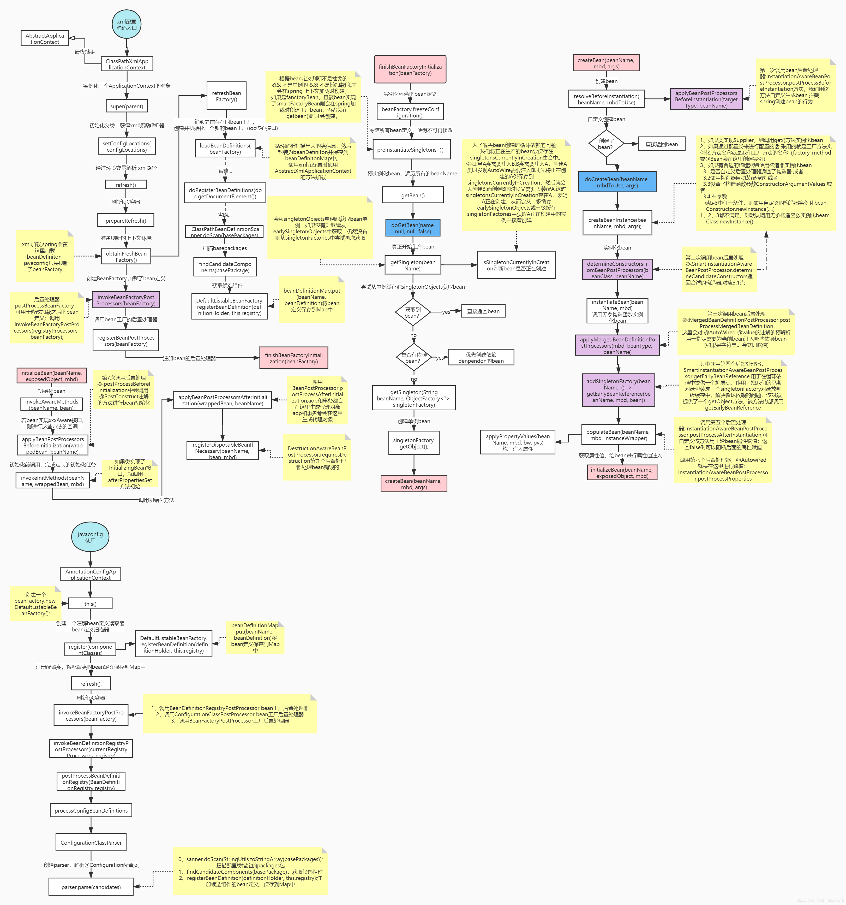

# Spring

Spring是一个支持快速开发Java EE应用程序的框架

它提供了一系列底层容器和基础设施，并可以和大量常用的开源框架无缝集成


本节专注于介绍Spring Framework，它是最核心的Spring框架

Spring Framework主要包括几个模块：

- 支持IoC和AOP的容器
- 支持JDBC和ORM的数据访问模块
- 支持声明式事务的模块
- 支持基于Servlet的MVC开发
- 支持基于Reactive的Web开发
- 以及集成JMS、JavaMail、JMX、缓存等其他模块


---


# IoC 容器

**容器**：一种为某种特定组件的运行提供必要支持的一个软件环境。

例如：Tomcat就是一个Servlet容器，它可以为Servlet的运行提供运行环；Docker提供了必要的Linux环境以便运行一个特定的Linux进程


Spring的核心就是提供了一个**IoC容器**，它可以管理所有轻量级的JavaBean组件，提供的底层服务包括组件的生命周期管理、配置和组装服务、AOP支持，以及建立在AOP基础上的声明式事务服务等


## IoC 原理

**IoC (Inversion of Control, 控制反转)** 

```java
public class UserService {
    private HikariConfig config = new HikariConfig();
    private DataSource dataSource = new HikariDataSource(config);
	...
}
```

传统Java设计中，在对象的内部通过new创建组件对象实例，是程序**主动创建组件对象**

```java
// 引入 注入 机制
public class UserService {
    private DataSource dataSource;
    // 不自己创建 而是等待外部通过set()方法来注入DataSource
    public void setDataSource(DataSource dataSource) { this.dataSource = dataSource;}
}
```

引入IoC：所有组件不再由应用程序自己创建和配置，而是由IoC容器负责，对象只是**被动地接收依赖的组件对象**

IoC是一种设计思想，利于松耦合，优美编程


**DI (Dependency Injection, 依赖注入)**

创建组件对象的过程中，将对象的属性值（简单值，集合，对象）通过配置注入给该对象

- 是IoC思想的一种具体实现技术
- 通过外部（通常是容器）将依赖对象注入到使用它们的组件中
- 由IoC容器负责管理组件的生命周期
- 有三种主要形式：构造函数注入、Setter方法注入和接口注入


在Spring的IoC容器中，我们把所有组件统称为JavaBean，即配置一个组件就是配置一个Bean

Spring 提供的IoC容器的实现方式：

1. BeanFactory：IoC 容器基本实现，Spring 内部的使用接口，加载配置文件时候不会创建Bean，在获取时才创建
2. ApplicationContext：继承自 BeanFactory，提供了一些额外的功能，在加载配置文件时一次性创建所有的Bean


## 装配 Bean

```java
public class AService {
    public void doSomething() {
        System.out.println("AService is doing something.");
    }  
}
public class BService {
    private AService aService;
    
    public void setAService(AService aService) {
        this.aService = aService;
    }
    
    public void doSomething() {
        System.out.println("BService is doing something.");
        aService.doSomething();
    }
}
```


#### XML 方式

准备`application.xml`配置文件，指导Spring的IoC容器创建并组装Bean

```xml
<?xml version="1.0" encoding="UTF-8"?>
<beans xmlns="http://www.springframework.org/schema/beans"
       xmlns:xsi="http://www.w3.org/2001/XMLSchema-instance"
       xsi:schemaLocation="http://www.springframework.org/schema/beans
        https://www.springframework.org/schema/beans/spring-beans.xsd">

    <!-- id Bean的唯一标识 -->
    <bean id="bService" class="org.example.service.BService">
        <!-- 通过<property name="..." ref="..." />注入另一个Bean -->
        <property name="aService" ref="aService" />
        <!-- 注入数据 而非其他Bean -->
        <!-- property name="username" value="root" / -->
    	<!-- property name="password" value="password" / -->
    </bean>

    <bean id="aService" class="org.example.service.AService" />
</beans>
<!-- Bean的顺序不重要，Spring根据依赖关系会自动正确初始化 -->

```

上述XML配置文件用Java代码写等同于：

```java
BService bService = new BService();
AService aService = new AService();
bService.setAService(aService);
```

区别在于 Spring容器是通过读取XML文件后使用**反射**完成的


创建一个**Spring的IoC容器实例**，加载配置文件，创建并装配好配置文件中指定的所有Bean

```java
ApplicationContext context = new ClassPathXmlApplicationContext("application.xml");
```

从Spring容器中“取出”装配好的Bean然后使用

```java
BService bService = context.getBean(BService.class);
bService.doSomething();
```


####  Annotation 方式

```java
// @Component 标记普通类为 Spring 管理的 Bean，可选名称，默认是小写开头的类名
// @Service @Controller @Repository是特例 若组件无法归类则使用 @Component
@Component
public class AService { ...}

@Component
public class BService {
    // 使用@Autowired就相当于把指定类型的Bean注入到指定的字段中
    @Autowired
    AService aService;
    ...
}

// @ComponentScan：告诉容器，自动搜索当前类所在的包以及子包，创建所有标注为@Component的Bean，并根据@Autowired进行装配
@Configuration
@ComponentScan
public class AppConfig {
    public static void main(String[] args) {
        ApplicationContext context = new AnnotationConfigApplicationContext(AppConfig.class);
        BService bService = context.getBean(BService.class);
        bService.doSomething();
    }
}
```


#### 条件装配

1. **Profile**
   Spring提供的表示运行环境的概念：开发native、测试test、生产production
   创建某个Bean时，Spring容器可以根据注解`@Profile`来决定是否创建
   在运行程序时，加上JVM参数`-Dspring.profiles.active=test`就可以指定以`test`环境启动
   	...active=test,master表示`test`环境，并使用`master`分支代码

   ```java
   @Configuration
   @ComponentScan
   public class AppConfig {
       @Bean
       @Profile("!test")
       ZoneId createZoneId() {
           return ZoneId.systemDefault();
       }
   
       @Bean
       @Profile({ "test", "master" }) // 满足test或master
       ZoneId createZoneIdForTest() {
           return ZoneId.of("America/New_York");
       }
   }
   ```

2. **Condition**

   ```java
   @Component
   @Conditional(OnSmtpEnvCondition.class)	// 满足 条件，才会创建此Bean
   public class SmtpMailService implements MailService {
       ...
   }
   public class OnSmtpEnvCondition implements Condition {
       public boolean matches(ConditionContext context, AnnotatedTypeMetadata metadata) {
           return "true".equalsIgnoreCase(System.getenv("smtp"));
       }
   }
   // 更简单的 结合配置文件判断
   @Component
   @ConditionalOnProperty(name="app.smtp", havingValue="true")
   public class MailService {
       ...
   }
   ```

3. ...


## 定制 Bean

#### Scope

默认情况下，Spring容器初始化时创建Bean**单例(Singleton)**，容器关闭前销毁Bean

容器运行期间，调用`getBean(Class)`获取到的Bean是同一个实例


```java
@Component
@Scope(ConfigurableBeanFactory.SCOPE_PROTOTYPE) // @Scope("prototype")
public class AService { ...}
```

使用`@Scope`注解指定为Prototype（原型）Bean，每次调用`getBean(Class)`，容器都返回一个新的实例


#### 注入 List

现在有一系列接口相同，不同实现类的Bean

```java
// 例如 注册用户时，我们要对email、password和name这3个变量进行验证
public interface Validator {
    void validate(String email, String password, String name);
}
@Component
@Order(1)
public class EmailValidator implements Validator {
    public void validate(String email, String password, String name) {
        if (email...) { ...}
    }
}
@Component
@Order(2)
public class PasswordValidator  implements Validator { ...}
...
// 最后通过一个Validators作为入口进行验证
@Component
public class Validators {
    // Spring会自动把所有类型为Validator的Bean装配为一个List注入
	// 使用@Order注解 指定List中Bean的顺序
    @Autowired
    List<Validator> validators;

    public void validate(String email, String password, String name) {
        for (var validator : this.validators) {
            validator.validate(email, password, name);
        }
    }
}

```


#### 可选注入

默认情况下，如果Spring没有找到标记为`@Autowired`对应类型的Bean，会抛出`NoSuchBeanDefinitionException`异常

给`@Autowired`增加参数`required = false`：表示如果找到一个标记的类型的Bean，就注入，如果找不到，就忽略


#### 第三方Bean

某个Bean不在我们自己的package管理之内，就在`@Configuration`类中编写一个Java方法创建并返回它

给方法标记一个`@Bean`注解

```java
@Configuration
@ComponentScan
public class AppConfig {
    // @Bean: 标注方法，指示该方法返回的对象将被注册为 Spring Bean，交由 IoC 容器管理
    // 后续直接通过方法参数注入
    @Bean
    ZoneId createZoneId() {
        return ZoneId.of("Z");
    }
}
```


#### 初始化和销毁

不管是`@Component`还是`@Bean`注册的 Bean，在 Spring 容器中都会经历以下核心生命周期阶段：

```plaintext
实例化（创建对象）→ 依赖注入（给属性赋值）→ 初始化（自定义的初始化逻辑）→ 就绪（供程序使用）→ 销毁（容器关闭前的清理逻辑）
```

1. @Component
   @PostConstruct：标注在非静态的无参方法上，Spring 会在依赖注入完成后自动执行该方法
   @PreDestroy：标注在非静态的无参方法上，Spring 会在容器关闭前自动执行该方法

2. @Bean

   ```java
   // 配置类
   @Configuration
   public class AppConfig {
       // 注册Bean，并指定初始化方法和销毁方法
       @Bean(initMethod = "init", destroyMethod = "destroy")
       public UserService userService() {
           return new UserService();
       }
   }
   
   // 普通类（无需任何注解/接口，纯POJO）
   public class UserService {
   
       // 初始化方法（方法名可自定义，无参数、无返回值、public）
       public void init() { ...}
       // 销毁方法（方法名可自定义，无参数、无返回值、public）
       public void destroy() { ...}
   }
   ```


#### 别名

有时需要对一种类型的Bean创建多个实例，例如，同时连接多个数据库，就必须创建多个`DataSource`实例

```java
@Configuration
@ComponentScan
public class AppConfig {
    @Bean("z")
    ZoneId createZoneOfZ() {
        return ZoneId.of("Z");
    }

    @Bean("utc8")
    ZoneId createZoneOfUTC8() {
        return ZoneId.of("UTC+08:00");
    }
}
@Component
public class MailService {
	@Autowired(required = false)
	@Qualifier("z") // 指定注入名称为"z"的ZoneId
    // 也可使用 @Primary 注册Bean时指定一个为主要Bean，这样，注入时若未指定Bean的名字就注入主Bean
	ZoneId zoneId = ZoneId.systemDefault();
    ...
}
```


#### 懒加载

@Lazy: **只对单例 Bean 生效**，Prototype Bean 默认懒加载

1. 对`@Component`标注的组件类使用`@Lazy`：容器启动时不创建实例，首次调用时才初始化

2. 标注在 @Bean 方法上

3.  标注在依赖注入的参数上：解决循环依赖

   ```java
   // UserService依赖OrderService
   @Service
   public class UserService {
       private final OrderService orderService;
   
       public UserService(OrderService orderService) { this.orderService = orderService;}
   }
   
   // OrderService依赖UserService
   @Service
   public class OrderService {
       private final UserService userService;
   
       public OrderService(UserService userService) { this.userService = userService;}
   }
   // 此时容器启动报错：BeanCurrentlyInCreationException
   // 解决：构造器参数上添加@Lazy
   // @Lazy会让 Spring 注入一个代理对象（而非真实的 OrderService 实例），当首次调用 OrderService 的方法时，才会创建真实的实例，从而打破循环依赖的死锁
   ...
   public UserService(@Lazy OrderService orderService) {
       this.orderService = orderService;
   }
   ...
   ```

4. 标注在 @Autowired 属性上：延迟注入依赖
   对`@Autowired`标注的属性添加`@Lazy`，表示该依赖的 Bean 为懒加载（即使依赖的 Bean 本身没有标注`@Lazy`）

5. 


#### 使用FactoryBean

```java
@Component
public class ZoneIdFactoryBean implements FactoryBean<ZoneId> {
    String zone = "Z";

    // 当一个Bean实现了FactoryBean接口后，Spring会先实例化这个工厂，然后调用getObject()创建真正的
    @Override
    public ZoneId getObject() throws Exception {
        return ZoneId.of(zone);
    }
	// BeangetObjectType()可以指定创建的Bean的类型，因为指定类型不一定与实际类型一致，可以是接口或抽象类
    @Override
    public Class<?> getObjectType() {
        return ZoneId.class;
    }
}
```


## Resource

使用Spring容器时，可以对配置文件、资源文件等进行注入，方便程序读取

```java
@Component
public class AppService {
    @Value("classpath:/logo.txt")
    private Resource resource;

    private String logo;

    @PostConstruct
    public void init() throws IOException {
        try (var reader = new BufferedReader(
                new InputStreamReader(resource.getInputStream(), StandardCharsets.UTF_8))) {
            this.logo = reader.lines().collect(Collectors.joining("\n"));
        }
    }
}
```


#### 注入配置

配置文件最常用的配置方法是以`key=value`的形式写在`.properties`文件中

可以用`Resource`来读取位于classpath下的一个`app.properties`文件，但这样依然比较繁琐


Spring容器还提供的`@PropertySource`可以自动读取配置文件

```java
@Configuration
@ComponentScan
@PropertySource("app.properties") // 表示读取classpath的app.properties
public class AppConfig {
    @Value("${app.zone:Z}")	// 读取key为app.zone的value，但如果key不存在，就使用默认值Z
    String zoneId;

    @Bean
    ZoneId createZoneId() {
        return ZoneId.of(zoneId);
    }
}
```


项目应用：

```java
// 先通过一个简单的JavaBean持有所有的配置
@Component
public class SmtpConfig {
    @Value("${smtp.host}")
    private String host;

    @Value("${smtp.port:25}")
    private int port;

    public String getHost() {...}
    public int getPort() {...}
}
// 需要读取的地方，使用#{smtpConfig.host}注入
@Component
public class MailService {
    @Value("#{smtpConfig.host}")	// 从名称为smtpConfig的Bean读取host属性，即调用getHost()方法
    private String smtpHost;

    @Value("#{smtpConfig.port}")
    private int smtpPort;
}
```


## IoC 加载流程

1. 创建 BeanFactory 容器
2. 解析配置信息，并将配置信息封装成 BeanDefinition 对象，再将其存入BeanFactory 
3. 执行工厂的后置处理器 BeanFactoryPostProcessor
4. 执行后置处理 BeanPostProcessor，注意: 这里不要和上一步搞混了，一个工厂后置处理器，一个是 Bean 后置处理器
5. 实例化 Bean 对象，这里的对象信息来源就是BeanFactory 中的 BeanDefinition 对象，这里只是单纯的实例化，没有参数赋值
6. Bean 初始化过程
7. 得到一个完整的 Bean 对象放入单例池中，IOC 容器构建结束




---


# AOP

**AOP**（Aspect Oriented Programming）：⾯向切⾯编程，通过**预编译**和**运行期间动态代理**来实现程序功能的统一维护的一种技术

AOP思想是OOP(面向对象)的延续：
	OOP中程序的基本单元是 class
	AOP中的基本单元是 Aspect(切面)


举个栗子：
现在有一个业务组件 BookService 其中有业务方法 createBook updateBook deleteBook
对每个业务方法，除了业务逻辑，还需要安全检查、日志记录和事务处理

```java
public class BookService {
    public void createBook(Book book) {
        securityCheck();
        Transaction tx = startTransaction();
        try {
            // 核心业务逻辑
            tx.commit();
        } catch (RuntimeException e) {
            tx.rollback();
            throw e;
        }
        log("created book: " + book);
    }
    ...
}
```

对于安全检查、日志、事务等代码，它们会重复出现在每个业务方法中

虽然可以使用设计模式比如 Proxy 进行模块抽取，但还是麻烦：须先抽取接口，然后，针对每个方法实现Proxy


引入AOP

把权限检查、日志、事务视作切面（Aspect），然后，以某种自动化的方式，让框架把切面织入到核心逻辑中，实现**Proxy模式**

1. 核心逻辑，即BookService
2. 切面逻辑：
   1. 权限检查的Aspect
   2. 日志的Aspect
   3. 事务的Aspect


## AOP 原理

把切面织入到核心逻辑：

1. 编译期：在编译时，由编译器把切面调用编译进字节码，这种方式需要定义新的关键字并扩展编译器，AspectJ就扩展了Java编译器，使用关键字aspect来实现织入
2. 类加载器：在目标类被装载到JVM时，通过一个特殊的类加载器，对目标类的字节码重新“增强”
3. 运行期：目标对象和切面都是普通Java类，通过JVM的动态代理功能或者第三方库实现运行期动态织入


## 装配 AOP

maven引入Spring对AOP的支持：org.springframework:spring-aspects:6.0.0

```java
@Aspect
@Component	// 本身也是一个Bean
public class loggingAspect {
    // 在执行BService的每个 public 方法前执行:
    @Before("execution(public * org.example.service.BService.*(..))")
    public void doAccessCheck() {
        System.err.println("[Before] do access check...");
    }

    // 在执行AService的每个方法前后执行:
    @Around("execution(public * org.example.service.AService.*(..))")
    public Object doLogging(ProceedingJoinPoint pjp) throws Throwable {
        System.err.println("[Around] start " + pjp.getSignature());
        Object retVal = pjp.proceed();
        System.err.println("[Around] done " + pjp.getSignature());
        return retVal;
    }
}
@ComponentScan
@EnableAspectJAutoProxy	
// IoC容器自动查找带有@Aspect的Bean，根据每个方法的@Before、@Around等注解把AOP注入到特定的Bean中
// Spring容器启动时自动创建注入了Aspect的子类，取代了原始的组件类（原始的组件实例作为内部变量隐藏在xxxAopProxy中）
// Spring对接口类型使用JDK动态代理，对普通类使用CGLIB创建子类。如果一个Bean的class是final，Spring将无法为其创建子类
public class AppTest extends TestCase {
    @Test
    public void test99() {
        ApplicationContext context = new AnnotationConfigApplicationContext(AppTest.class);
        BService bService = context.getBean(BService.class);
        bService.doSomething();
    }
}
```


#### 拦截器类型

- @Before：这种拦截器先执行拦截代码，再执行目标代码。如果拦截器抛异常，那么目标代码就不执行了
- @After：这种拦截器先执行目标代码，再执行拦截器代码。无论目标代码是否抛异常，拦截器代码都会执行
- @AfterReturning：和@After不同的是，只有当目标代码正常返回时，才执行拦截器代码
- @AfterThrowing：和@After不同的是，只有当目标代码抛出了异常时，才执行拦截器代码
- @Around：能完全控制目标代码是否执行，并可以在执行前后、抛异常后执行任意拦截代码，可以说是包含了上面所有功能


#### 注解装配

前面是用的AspectJ的注解，并配合一个复杂的`execution(* xxx.Xyz.*(..))`语法来定义应该如何装配AOP

```java
// 定义注解 实现监控应用程序的性能
@Target(METHOD)
@Retention(RUNTIME)
public @interface WelcomeAnnotation {
    String value() default "";
}
// 切面
@Aspect
@Component
public class WelcomeAspect {
    @Around("@annotation(welcomeAnnotation)")
    public void welcome(ProceedingJoinPoint joinPoint, WelcomeAnnotation welcomeAnnotation) throws Throwable {
        String name = welcomeAnnotation.value();
        System.err.println("welcome: " + name + ", signature: " + joinPoint.getSignature());
        joinPoint.proceed();
        System.err.println("byebye: " + name);
    }
}

@Component
public class BService {
    @WelcomeAnnotation("zhangsan")
    public void doSomething() {
        System.out.println("BService is doing something.");
        aService.doSomething();
    }
}
// 有了@xxxAnnotation，再配合xxxAspect，任何Bean，只要方法标注了@xxxAnnotation，就可以自动实现xxxx
```

